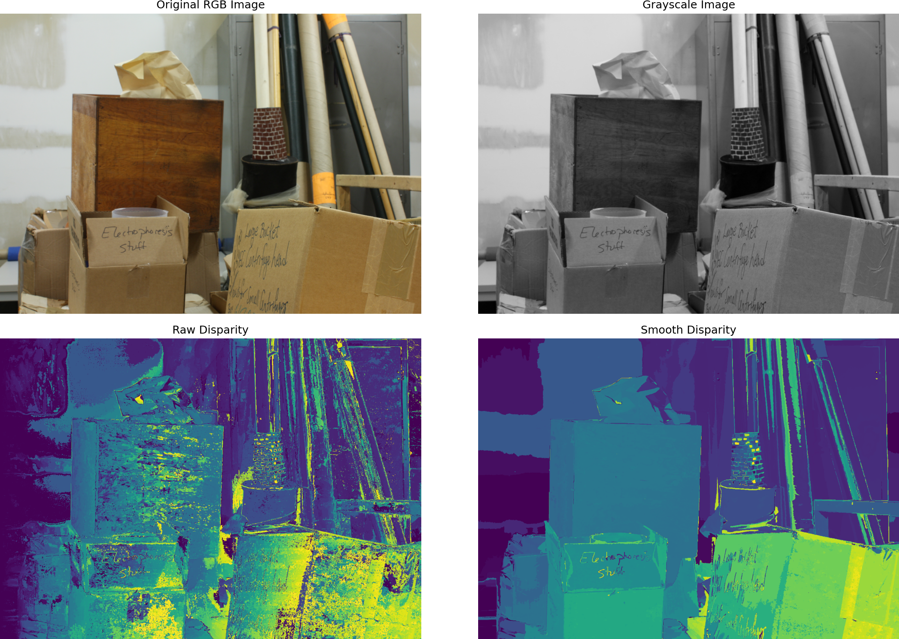
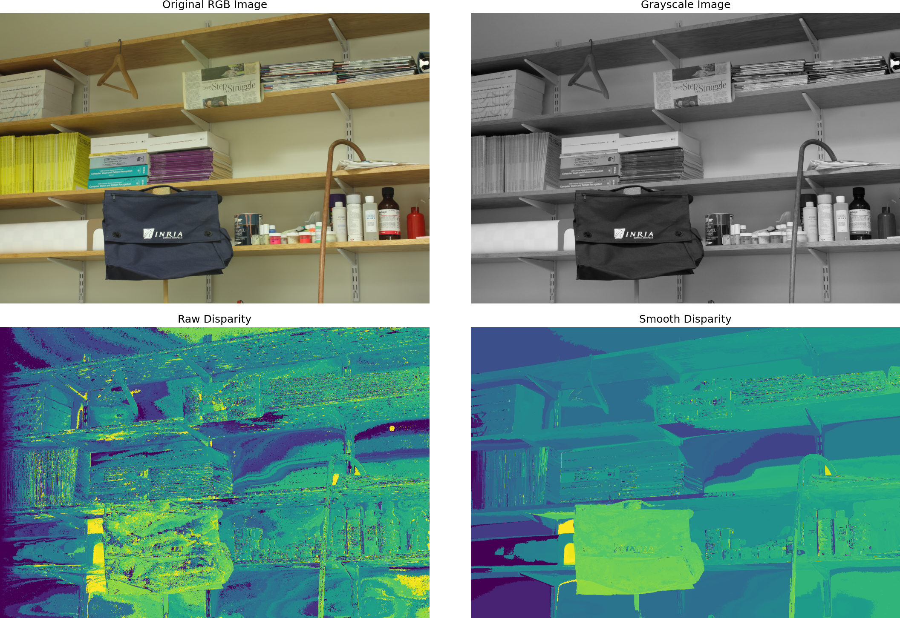
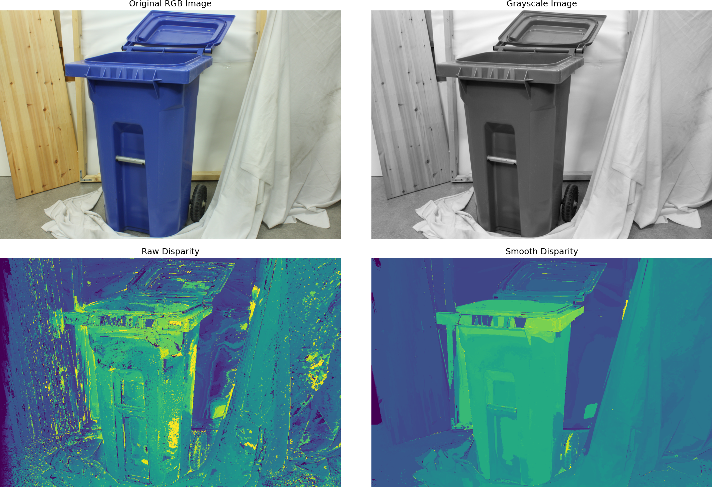
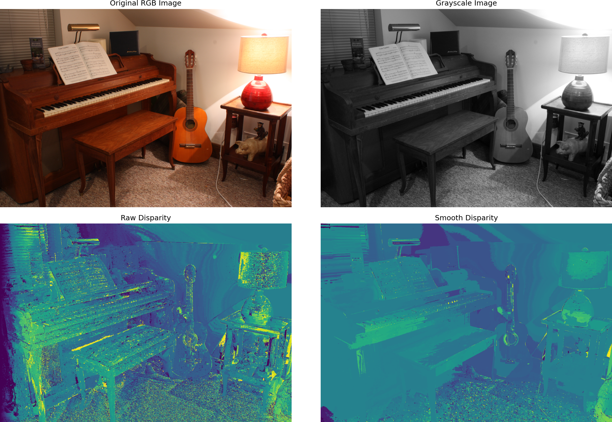

---
author:
- Anurag Gupta
date: 1970-01-01
title: Stereo Depth Reconstruction
---
# Report

## Theory

For stereo vision we need two pictures taken side by side and the camera
details. This will helps us estimate the depth of the surfaces in the
image. First we caclculate how much a pixel has shifted from the first
picture to the second picture. This will help us identify the shift of
pixels with relation to other pixels. Thus giving us a map called the
disparity map which is just the array of pixel shifts. From the
calibration data of the cameras we can get some information that will
estimate the metric depth of a surface thus allowing us to create a 3D
object.

The relationship between disparity ($d$) and depth ($Z$) is defined as
follows:

$$Z = \frac{f \cdot B}{d + d_{offs}}$$

where:

-   $f$: Focal length in pixels

-   $B$: Baseline distance between cameras

-   $d_{offs}$: Disparity offset

## Dataset

We have used the Middlebury 2014 dataset for stero depth images. It
includes two images, one taken from the left camera labelled as
'im0.png' and one from the right camera labelled 'im1.png'. There is the
ground truth disparity images labelled as 'disp0.pfm' and 'disp1.pfm'
respectively. There is also a file called 'calib.txt' which contains the
camera information like focal length, number of pixels, baseline,
disparity offset, etc ...

There are 33 image sets out of which 23 have ground truths publicly
available and we will be showing some sample outputs using various
threshold. Since computation takes a little long for generating
disparity over all the images, we will be using 0.5 times the original
resolution for sample outputs.

## Algorithmic Pipeline

### Texture Segmentation

We suggest that pixels with same colour intensity on a 2D imag would
make a flat surface in the original 3D environment. This is due to the
fact that shading causes intensity to differ based on the depth of the
object relative to the source of the light. So we assume that shading is
relatively correct in the image and start partitioning the image into
multiple segments with colour intensity within a threshold amount from
the original starting pixel.

We use the basic BFS style finding mechanism also called Flood-Fill
algorithm to locate pixels that have valid colour intensity. Overwriting
a region by a different segment's continuation is not allowed for
computation benefit. The origin pixels are choosen randomly. The top,
left, bottom, and right pixels of the original pixel are considered the
only valid neighbours while searching. Each region is called a texture.
Each texture gets a different number assigned to it and we also maintain
a dictionary with the texture numbers as key and the list of points
masked by that texture as the value.

Input Needed -> Grayscale image $I$, Intensity threshold $\tau$ Texture labels $T$,
Region dictionary $\mathcal{D}$

Algorithm -> Initialize $T \gets \mathbf{0}_{h\times w}$, $label \gets 1$
$\mathcal{D}[label] \gets \emptyset$ $stack.push((x,y))$
$I_{seed} \gets I(x,y)$ $(cx,cy) \gets stack.pop()$
$T(cx,cy) \gets label$ $\mathcal{D}[label].add((cx,cy))$
$stack.push((nx,ny))$ $label \gets label + 1$

### Disparity Estimation

We use the left iamge as our original image. For every texture we first
get the list of points masked by that texture. Using the search distance
received as input we create a list of masks. Each mask being a k pixels
away from the original mask where k ranges from 0 to maximum search
distance. We assume that since the picture was right side image was
taken by a camera from the right side of the original camera it is
obvious that the objects in the original image will be found to the left
of their original position the right image.

Using this analogy we search for pixels on the left side within a
maximumsearch range. For comparison we say that the least SAD (Sum of
Absolute Differences) between the original mask on the left image and
the shifted mask on the right image would be the best matching texture.
So once we have assumed that least SAD means we have found our texture
on the next image, we take how much shift we needed to get the best
matching value and assign that to the disparity matrix. The disparity
values is now tightly bound by $disp \in [0, \text{max disp}]$ and
$disp \in \mathbb{Z}$

Input Needed -> Left image $I_l$, Right image $I_r$, Calibration data $\mathcal{C}$
Disparity map $D$

Algorithm -> Segment $I_l$ into texture regions $\mathcal{R} = \{R_1 \cdots R_n\}$
via Algorithm 2 Extract representative pixel $(x_0,y_0) \in R_i$ Compute
SAD cost: $C(d) \gets \sum_{(x,y)\in R_i} |I_l(x,y) - I_r(x-d,y)|$ Track
$d^* \gets \arg\min_d C(d)$ Assign $D(x,y) \gets d^*$ for all
$(x,y) \in R_i$

**Advantages over correlation:**

-   3.2$\times$ faster computation

-   Better preservation of texture boundaries

-   Natural noise reduction within homogeneous regions

### Post-Processing

When we estimated the disparity we used very constrained threshold to
create as many textures possible but has led to a slightly noisy and
very grainy disparity matrix. To create a gradient like effect on the
disparity matrix we will create texture of higher thresholds. Then take
the disparities in that texture mask and compute the median value. Then
if any value is more that the threshold amound from the median value we
replace the out of range value with the median value. The post
processing mechanism can be applied multiple times to achieve good
results.

Input Needed -> Raw disparity $D$, Original image $I$, Iterations $N$ Refined disparity
$\hat{D}$

Algorithm -> Segment $I$ with relaxed threshold ($\tau_k \gets 20 \times k$) Compute
median disparity $\tilde{d}_j \gets \mathrm{median}(D(S_j))$ Reject
outliers where $|D(p) - \tilde{d}_j| > 0.07\tilde{d}_j$ 

## Implementation Details

### Mesh Generation

We are also given the camera details in the dataset and thus we can use
formula (1) to generate the depth of each pixel with respect to their
disparity values. This will create a point cloud of points in 3D. Given
the computed 3D point cloud $\mathcal{P} = \{\mathbf{p}_i\} {i=1}^N$
where $\mathbf{p}_i = (x_i, y_i, z_i, r_i, g_i, b_i)$, we initiate the
mesh reconstruction. For every vertexx we compute the distance between
it and its neighbours, if the distance falls within a given threshold we
create a triangle face between them. For colouring the faces we use the
average colour of the corresponding vertices loaded from the original
rgb file of the image.

Input Needed -> Point cloud $\mathcal{P}$, distance threshold $\tau$ 3D mesh
$\mathcal{M}(V,F)$ with vertices $V$ and faces $F$

Algorithm -> Deduplicate points: $V \gets \{\mathbf{v}_k\} \subseteq \mathcal{P}$
where $\|\mathbf{v}_k - \mathbf{v}_l\| > \epsilon$ Construct 2D grid
topology: $(h,w) \gets \text{infer grid dimensions}(V)$ Initialize
face set: $F \gets \emptyset$

Define candidate vertices:
$\quad v_1 \gets V[i,j],\ v_2 \gets V[i,j+1],\ v_3 \gets V[i+1,j],\ v_4 \gets V[i+1,j+1]$

Add triangle $F \gets F \cup \{(v_1,v_2,v_3)\}$ Add triangle
$F \gets F \cup \{(v_2,v_4,v_3)\}$

Compute vertex normals:
$\mathbf{n}_k \gets \frac{1}{|N(k)|}\sum_{j\in N(k)}(\mathbf{v}_j - \mathbf{v}_k)$
Export $\mathcal{M}(V,F)$ as PLY file with vertex colors

The Open3D library handles the final mesh export in binary PLY format,
combining:
$$\mathcal{M} = \underbrace{\{\mathbf{v}_i\}}_{V} \cup \underbrace{\{(r_i,g_i,b_i)\}}_{\text{colors}} \cup \underbrace{\{(i,j,k)\}}_{F}$$

### Parameters

  **Parameter**               **Value**   **Rationale**
  --------------------------- ----------- ---------------------------------------------
  Initial Texture Threshold   20          Balances detail vs Over-Segmentation
  Post-Process Threshold      100         Gradient Disparity vs Grainy and Noisy
  Post-process Iterations     4           Observed Best Value
  Mesh Face Threshold         150px       Prevents distant points from creating faces

## Conclusion

The proposed pipeline demonstrates that texture-constrained disparity
estimation combined with constrained texture post-processing yields
superior results compared to traditional methods like comparing pixel by
pixel. The most importat part is matching object from the left image to
the right image perfectly. This algorithm's assumption of similar
colours seems to be on the right path.

Future work could explore:

-   GPU acceleration for real-time performance on disparity matrix
    calculation

-   Texture segmentation over RGB data instead of gray image

-   Deep learning-based texture segmentation

-   Adaptive thresholding schemes during post-processing

## Sample Outputs

Storage

Shelves

Recycle

Piano
